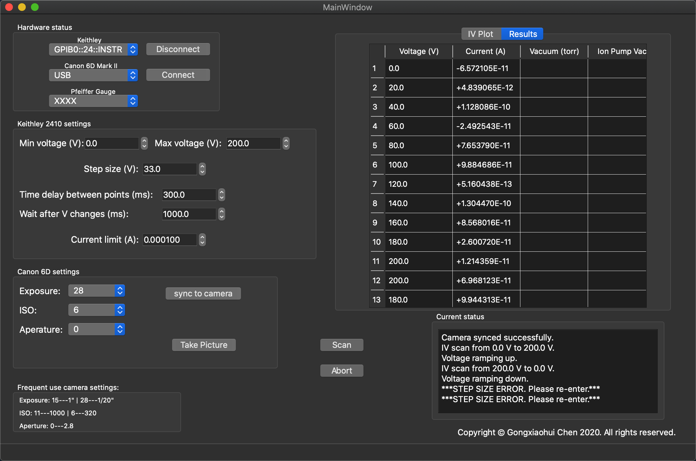

# FE Control Panel

## Description
 This file is to control the DC field emission test-stand. A GUI is made to control a Keithley 2410, a CCD camera,
and a Pfeiffer Gauge.

## TODOs
- [ ] Live plot to graphicsView
- [ ] Continuous update QTableWidget
- [ ] Test pfeiffer gauge reading module

  